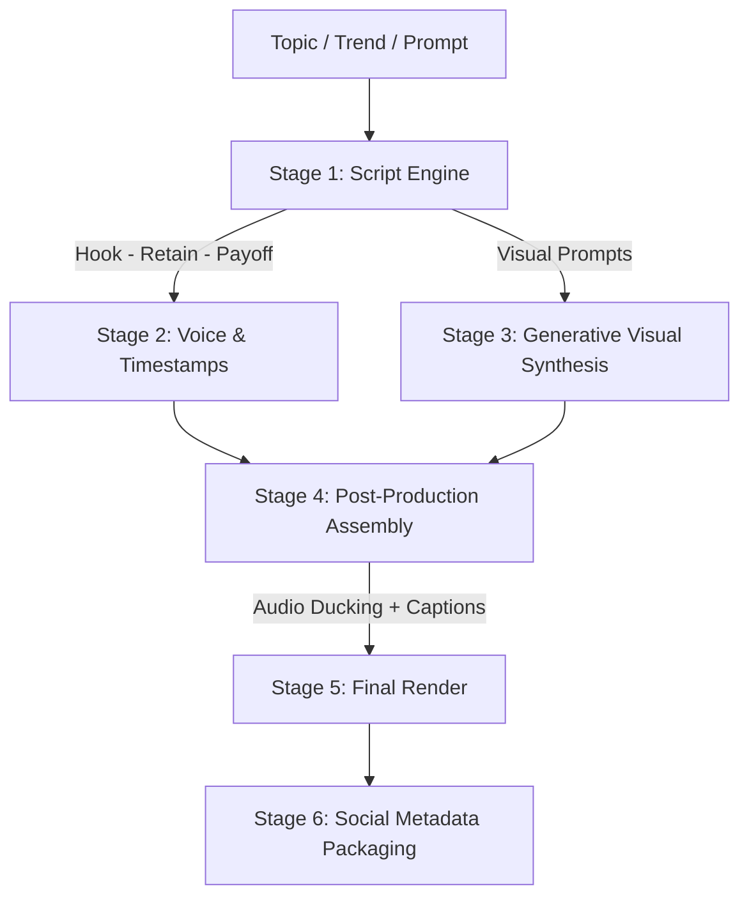

# Autonomous Content Pipeline Skill

This skill defines the autonomous orchestration protocol for turning any topic, prompt, or article into a fully rendered, ready-to-publish short-form (`9:16`) or landscape (`16:9`) video package.

---

## 1. Pipeline Stages Overview



### Stage 1: Script Engine (Hook $\to$ Retain $\to$ Payoff)
- **The First 2.5 Seconds (Hook)**: Creates cognitive dissonance, a pattern interrupt, or an urgent question. Example: *"Stop using ChatGPT like a search engine. You're losing hours every week."*
- **The Retain Segment (Pacing & Value)**: 3 to 4 actionable, punchy insights delivered with 2.5–3.0 second scene visual cuts.
- **The Payoff & CTA**: Clear resolution and a high-converting call to action.

### Stage 2: Voiceover & Timestamping
- Synthesize voice narration using Edge-TTS or ElevenLabs.
- Extract precise word-level start and end timestamps.
- Calculate total audio duration to strictly bound visual scene intervals.

### Stage 3: Generative Visual Synthesis
- Break script into timed visual scenes ($N$ scenes = $\lceil \text{duration} / 3.5 \rceil$).
- Generate cinematic B-roll prompts for each scene.
- Synthesize clips via Gemini Omni Flash / Veo / AI video generation models.
- Fallback gracefully to high-res cinematic images with Ken Burns dynamic motion if video synthesis quotas or latency require it.

### Stage 4: Post-Production Assembly
- Normalize voiceover audio to `-16 LUFS`.
- Apply sidechain compression to background music track (ducking by -12dB).
- Generate animated karaoke ASS/SRT subtitles matching word timestamps.

### Stage 5: Final Render
- Concat video scenes, apply transitions.
- Burn subtitles in the safe viewing area (`margin_v = 480` for 1080x1920).
- Encode to H.264 MP4 with `-movflags +faststart`.

### Stage 6: Social Metadata Packaging
- Generate 3 high-CTR title variations.
- Generate SEO description with timestamps.
- Generate 10–15 trending hashtags.
- Generate image prompt for a click-worthy YouTube thumbnail.

---

## 2. End-to-End Execution Protocol

When invoking the pipeline via CLI or code:

```bash
# Full automated pipeline execution
python cli.py auto-short --topic "3 Mind-Bending Paradoxes That Break Reality" --style cinematic --voice en-US-ChristopherNeural --output output/paradoxes_short.mp4
```

### Programmatic Python Orchestration
```python
from src.generators.script_generator import generate_script
from src.generators.voice_generator import synthesize_voice
from src.generators.video_generator import generate_scene_visuals
from src.processors.caption_engine import build_karaoke_subtitles
from src.processors.ffmpeg_engine import assemble_video_package
from src.core.models import ContentRequest

async def run_pipeline(request: ContentRequest) -> str:
    # 1. Script
    script = await generate_script(request.topic, style=request.style)
    
    # 2. Voice + Word Timings
    audio_path, word_timings = await synthesize_voice(script.full_text, voice=request.voice)
    
    # 3. Visuals per scene
    scene_clips = await generate_scene_visuals(script.scenes, aspect_ratio=request.aspect_ratio)
    
    # 4. Captions
    ass_path = build_karaoke_subtitles(word_timings, output_path="captions.ass")
    
    # 5. Render
    final_video = assemble_video_package(
        clips=scene_clips,
        voiceover_audio=audio_path,
        background_music=request.music_track,
        subtitles_file=ass_path,
        output_file=request.output_path
    )
    return final_video
```

---

## 3. Quality Standards & Heuristics

1. **Duration Constraints**:
   - YouTube Shorts / TikTok / Reels: 35s to 58s (never exceed 60s).
   - Ideal cut frequency: Every 2.5 to 3.5 seconds.
2. **Audio Balance**:
   - Voiceover must always be distinctly audible, crisp, and center-panned.
   - Background music must never compete with vocal frequencies (ducking threshold: 0.08, ratio: 5:1).
3. **Typography**:
   - 2 to 4 words visible at once maximum.
   - Active spoken word highlighted in vibrant primary accent (neon yellow `#00FFFF` in BGR or cyber green `#00FF66`).
4. **Metadata Integrity**:
   - Always save a companion `metadata.json` alongside the rendered `.mp4` containing the full script, scene prompts, and publication tags.
