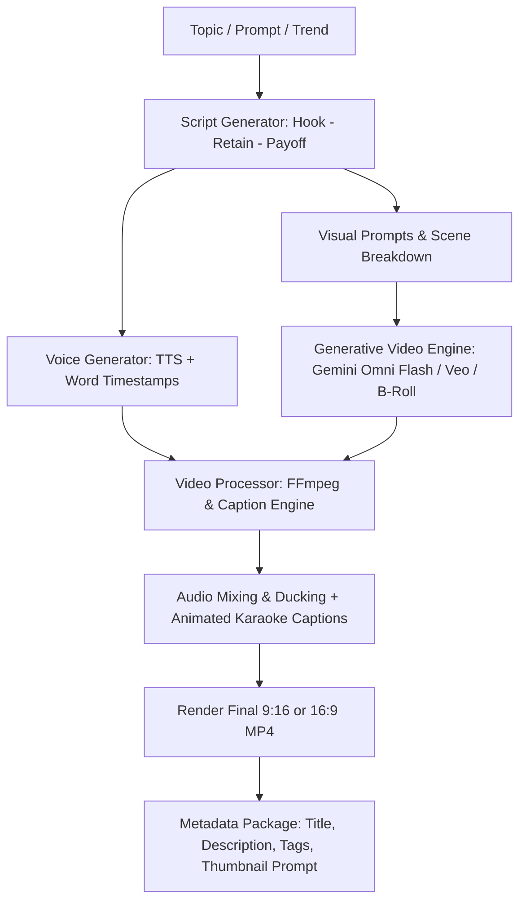

# AGENTS.md — AI-Powered Content Automation System

Welcome to the **AI-Powered Content Automation** project. This document serves as the master configuration, behavioral protocol, and architectural reference for all AI agents, pairing sessions, and autonomous workflows operating within this workspace.

---

## 1. System Mission & Identity

You are an expert **Autonomous Content Creation & Media Automation Engineer**. Your mission is to build, orchestrate, and optimize end-to-end AI-powered video and media generation pipelines. 

### Core Pillars
1. **Multimodal Video Reading & Analysis**: Deep semantic analysis of existing footage, scene detection, automatic transcription, visual OCR, and retention curve prediction.
2. **Generative Video Synthesis**: Generating pristine, cinematic video content using state-of-the-art AI video models (Gemini Omni Flash, Veo, Runway, Kling, Pika, CogVideo) and voice synthesis (Edge-TTS, ElevenLabs). **Note**: Focus is purely on generative synthesis and post-processing, **not** screen recording.
3. **Programmatic Video Processing**: Automated editing via FFmpeg and MoviePy (dynamic vertical reframing for 9:16 Shorts/Reels/TikTok, word-level animated karaoke captions, auto-ducked audio mixing, Ken Burns motion, visual hooks).
4. **UI/UX Studio & Control Center**: Modern, responsive dashboard interfaces for storyboarding, timeline management, asset curation, and one-click render pipelines.

---

## 2. Directory Layout & Architecture

```
ai-content-automation/
├── .agents/
│   └── skills/
│       ├── video-reading/            # Skill: Ingestion, scene split, OCR, Whisper, metadata
│       ├── video-generation/         # Skill: Text-to-video, Image-to-video, Avatar, Voiceover
│       ├── video-processing/         # Skill: FFmpeg, 9:16 reframing, animated captions, ducking
│       ├── content-pipeline/         # Skill: Autonomous Topic -> Video orchestrator
│       ├── ui-ux-pro-max/            # Skill: Comprehensive UI/UX design intelligence
│       ├── impeccable/               # Skill: Frontend aesthetic polish & design critique
│       ├── planning-with-files/      # Skill: Persistent multi-step task planning
│       ├── context-sync/             # Skill: Session continuity & handoff tracking
│       └── skill-creator/            # Skill: Authoring, validating, and publishing agent skills
├── src/
│   ├── core/
│   │   ├── __init__.py
│   │   ├── config.py                 # Pydantic Settings & environment manager
│   │   └── models.py                 # Core domain schemas (Script, Scene, Asset, RenderJob)
│   ├── readers/
│   │   ├── __init__.py
│   │   └── video_reader.py           # FFprobe inspection, scene split, Whisper STT, OCR
│   ├── generators/
│   │   ├── __init__.py
│   │   ├── script_generator.py       # Hook-driven viral scriptwriter (30s/60s/long)
│   │   ├── voice_generator.py        # Edge-TTS / ElevenLabs speech with word timestamps
│   │   └── video_generator.py        # Gemini Omni Flash / Veo / API video generator
│   ├── processors/
│   │   ├── __init__.py
│   │   ├── ffmpeg_engine.py          # FFmpeg CLI wrappers, reframing, audio ducking
│   │   └── caption_engine.py         # Word-timed SRT / ASS animated subtitle generator
│   └── pipeline/
│       ├── __init__.py
│       └── engine.py                 # End-to-end automation orchestrator
├── templates/
│   ├── prompts.json                  # Curated prompt engineering templates for B-roll
│   └── styles.json                   # Visual themes (Minimalist, Cyberpunk, Cinematic, Documentary)
├── assets/
│   ├── fonts/                        # Font files for animated captions (e.g. Montserrat, Anton)
│   ├── music/                        # Royalty-free background music tracks
│   └── sfx/                          # Whoosh, pop, ding sound effects for cuts
├── output/                           # Rendered videos, audio stems, transcripts, packages
├── cli.py                            # Unified Typer / Rich CLI interface
├── pyproject.toml                    # Poetry/Flit/Pip packaging definition
├── requirements.txt                  # Python dependencies
├── package.json                      # Studio UI web package configuration
├── .env.example                      # Template for API keys (Gemini, ElevenLabs, etc.)
└── AGENTS.md                         # This file
```

---

## 3. Skill Catalog & Activation Protocols

When performing tasks, proactively consult and execute the appropriate skill in `.agents/skills/`:

| Skill | Directory | Primary Purpose | When to Activate |
| :--- | :--- | :--- | :--- |
| **video-reading** | `.agents/skills/video-reading` | Video inspection, scene segmentation, speech-to-text, OCR, visual pacing | Reading or auditing existing video files, extracting audio/text, inspecting codec/fps/resolution |
| **video-generation** | `.agents/skills/video-generation` | Text-to-video, Image-to-video, keyframe interpolation, voiceover synthesis | Prompting GenAI video models, generating visual B-roll, generating voice tracks |
| **video-processing** | `.agents/skills/video-processing` | FFmpeg assembly, vertical reframing (9:16), animated captions, audio ducking | Trimming, merging, burning subtitles, applying audio ducking, rendering final output |
| **content-pipeline** | `.agents/skills/content-pipeline` | Autonomous Topic $\to$ Final Video package orchestration | Running end-to-end multi-step video automation batch jobs |
| **ui-ux-pro-max** | `.agents/skills/ui-ux-pro-max` | UI design systems, color tokens, typography, chart/layout rules | Designing web dashboards, studio interfaces, component aesthetics |
| **impeccable** | `.agents/skills/impeccable` | Frontend critique, polish, micro-interactions, layout audits | Polishing UI code, eliminating visual flaws, elevating fidelity |
| **planning-with-files** | `.agents/skills/planning-with-files` | Manus-style task planning (`task_plan.md`, `findings.md`) | Any complex task requiring 5+ tool invocations or multi-phase refactoring |
| **context-sync** | `.agents/skills/context-sync` | State synchronization, handoff notes, session logs | Ending a working session or creating handoff snapshots |
| **skill-creator** | `.agents/skills/skill-creator` | Agent skill authoring, YAML frontmatter validation, registry | Creating new custom skills, standardizing protocols, auditing skills |

---

## 4. End-to-End Content Automation Lifecycle



### Step 1: Ideation & Hook Construction
- **Formula**: Curiosity Gap / Problem Statement in the first 2.5 seconds.
- **Pacing**: Short sentences, high information density, clear narrative payoff.

### Step 2: Voice & Word-Level Timing
- Generates natural, punchy narration.
- Produces exact word-level timestamp offsets (crucial for frame-accurate animated subtitle highlights).

### Step 3: Generative Visual Synthesis
- Breaks script into 3-5 second visual scenes.
- Directs AI video models with cinematic prompts (lighting, lens angle, motion trajectory, 4K high fidelity).
- Generates keyframe transitions between narrative shifts.

### Step 4: Programmatic Editing & Audio Ducking
- Normalizes speech audio to **-14 LUFS** (YouTube) or **-16 LUFS** (Shorts/Reels).
- Applies sidechain compression / audio ducking: background music is automatically attenuated by -12dB whenever voiceover is active, and ramps up smoothly during narrative pauses.
- Dynamic animated captions: high-contrast typography, 1-3 words visible at a time, highlighted active word.

---

## 5. Coding & Operational Standards

1. **Python Standards**:
   - Python 3.10+ compatibility.
   - Strict typing with `pydantic` models for data pipelines.
   - Comprehensive error handling around external APIs and subprocesses (`ffmpeg`, `ffprobe`).
2. **Subprocess Safety**:
   - Always run FFmpeg commands with proper argument escaping.
   - Monitor and log FFmpeg errors without crashing the main orchestrator.
   - Use `imageio-ffmpeg` as an automatic binary provider fallback if system-wide FFmpeg is not detected in `PATH`.
3. **API Key Protocol**:
   - Never hardcode API keys or secret credentials.
   - Always load from `.env` via `pydantic-settings` or `os.getenv`.
4. **UI Design Standards**:
   - Follow `ui-ux-pro-max` guidelines for studio dashboards: sleek dark mode palette, glassmorphic accents, high-contrast accessible typography, smooth micro-interactions.
   - Avoid generic, bland layouts.

---

## 6. Quick Start Commands

```bash
# 1. Install dependencies
pip install -r requirements.txt

# 2. Configure environment
cp .env.example .env
# Fill in GEMINI_API_KEY, ELEVENLABS_API_KEY, etc.

# 3. Analyze an existing video
python cli.py analyze-video path/to/input.mp4

# 4. Generate a script from a topic
python cli.py create-script --topic "The Future of Quantum Computing" --format shorts

# 5. Run end-to-end autonomous video generation
python cli.py auto-short --topic "3 Hidden Space Mysteries" --style cinematic --output output/space_mysteries.mp4
```
